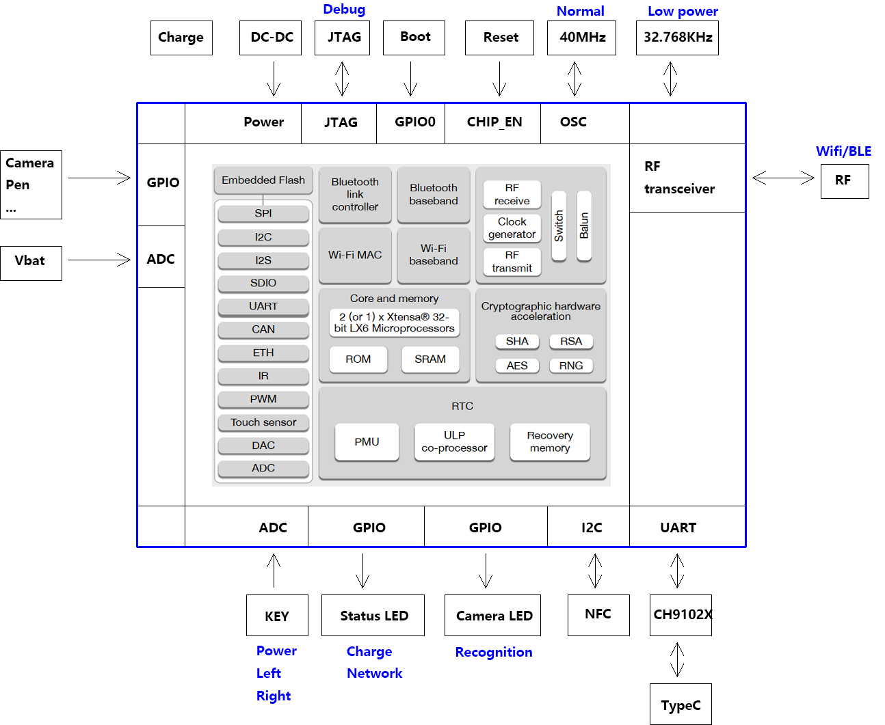
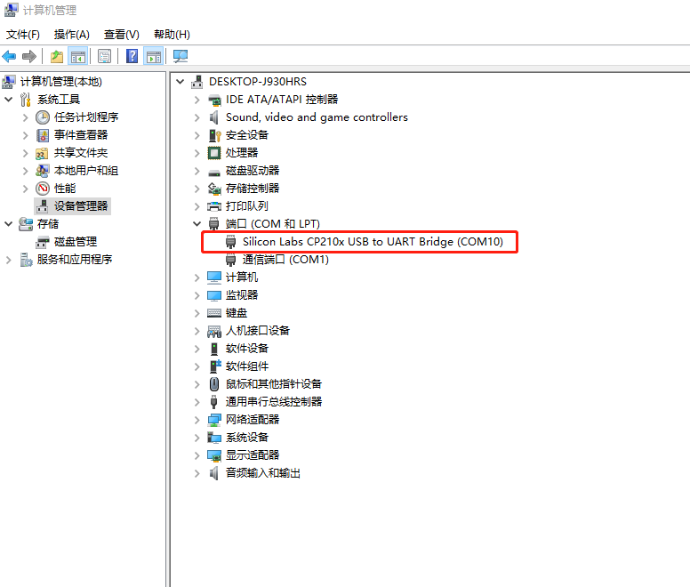
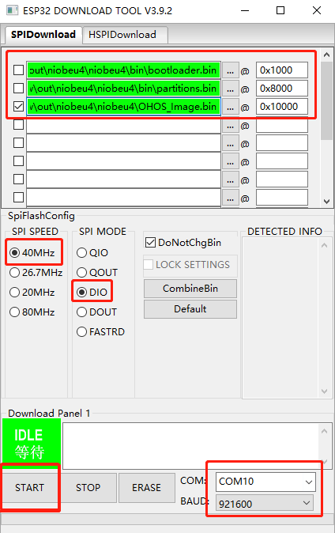

# device_board_openvalley


## 简介
Niobe U4是基于ESP32U4WDH推出的物联网设备开发套件，集成2.4GHz Wifi和蓝牙双模，具有超高的射频性能、稳定性、通用性和可靠性，以及超低的功耗，适用于各种应用场景；Niobe U4开发套件还支持NFC非接触式通讯功能，工作频率13.56MHz，适用于低功耗、低电压和低成本要求的非接触读写器应用；Niobe U4开发套件还支持锂电池供电和充放电管理；开发套件提供一个开箱即用的智能硬件解决方案，方便开发者验证和开发自己的软件和功能，缩短产品研发周期并快速推向市场。

开发板整体外观视图如下：


## 硬件结构与功能框图
Niobe U4开发套件采用单面元器件的单板形式，板上主控的绝大部分管脚均已引出到排针上，开发人员可根据实际需求，轻松通过跳线连接多种外围器件。功能示意框图如下：

- 功能框图

   

## 开发板资源
| 器件类别 | 开发板 |
| ----  | ---- |
| CPU | 采用集成WIFI+蓝牙+MCU的ESP32单芯片方案，支持802.11 b/g/n，支持蓝牙V4.2 完整标准，包括传统蓝牙（BR/EDR）和低功耗蓝牙（BLE），32-bit LX6 单核处理器，运算能力高达200 MIPS。 |
| FLASH | 4MB SPI Flash |
| RAM | 448KB ROM+520KB SRAM |
| GPIO | 35个 |
| I2C | 2路 |
| UART | 23个 |
| PWM | 1个 |
| JTAG | 1个 |
| ADC | 2个 |
| NFC      | 1个                                                          |
| USB      | 1个                                                          |
| Button   | 5个                                                          |

## 开发环境搭建

系统环境要求：建议Ubuntu20.04版本及以上（若使用18.04版本，需将python3.6升级为python3.8）

系统镜像建议下载地址: [阿里云开源镜像站](https://mirrors.aliyun.com/oldubuntu-releases/releases/20.04.3/)

### 更新Ubuntu源

- 打开`sources.list`文件

```
sudo gedit /etc/apt/sources.list
```

- 将与系统对应版本源复制并覆盖至上述打开的文件中，保存关闭，执行如下命令。（建议使用[阿里源](https://developer.aliyun.com/mirror/ubuntu)）

```
sudo apt update
```

### 安装依赖工具与库

- 安装ccache（用于加速编译）

```shell
sudo apt install ccache
```

- 安装git工具并配置用户名和邮箱

```
sudo apt install git git-lfs
git config --global user.email "xxx"
git config --global user.name "xxx"
```

- 设置python软链接为python3.8

```shell
sudo update-alternatives --install /usr/bin/python python /usr/bin/python3.8 1
```

- 安装并升级Python包管理工具(pip3)

```
sudo apt-get install python3-setuptools python3-pip -y
sudo pip3 install --upgrade pip
```

- 安装python3工具包

```
pip3 install --trusted-host mirrors.aliyun.com -i http://mirrors.aliyun.com/pypi/simple jinja2 ohos-build==0.4.6
```

- 将hb工具添加至环境变量：

```
gedit ~/.bashrc  #打开环境配置文件
export PATH=$PATH:~/.local/bin  #添加该语句至文件末尾，保存退出
source ~/.bashrc #使环境配置文件生效
```

### 安装repo工具

如果已经安装并拉取过OpenHarmony代码，请忽略该步骤。

如果是通过apt install安装的repo，请卸载后按照下述步骤重新安装:

```shell
sudo apt install curl -y
curl -s https://gitee.com/oschina/repo/raw/fork_flow/repo-py3 > repo
chmod a+x repo
sudo mv repo /usr/local/bin/
```

### 安装交叉编译工具链

新建一个目录，用来存放下载的编译工具链:

```shell
mkdir -p ~/download && cd ~/download
```

下载交叉编译工具链压缩包:

```shell
wget https://dl.espressif.com/dl/xtensa-esp32-elf-gcc8_4_0-esp-2021r2-linux-amd64.tar.gz
```

将交叉编译工具添加至环境变量：

- 解压工具链:

```shell
sudo tar axvf xtensa-esp32-elf-gcc8_4_0-esp-2021r2-linux-amd64.tar.gz -C /opt/ 
```

- 打开配置文件:

```shell
gedit ~/.bashrc
```

- 在文件末尾添加：

```shell      
export PATH=$PATH:/opt/xtensa-esp32-elf/bin
```

- 使配置生效:   

```shell
source ~/.bashrc
```

## 源码获取

```shell
mkdir niobeu4_src && cd niobeu4_src
repo init -u https://gitee.com/openharmony-sig/manifest.git -m devboard_niobeu4.xml
repo sync -c
repo forall -c 'git lfs pull'
repo start master --all
```

## 源码构建

- 进入源码根目录，执行`hb set`命令并选择openvalley下项目`niobeu4`

  ```shell
  hb set
  ```

- 执行`hb build -f`脚本构建产生固件

  ```shell
  hb build -f
  ```

  构建成功会提示类似如下信息:

  ```
  [OHOS INFO] subsystem       	files NO.	percentage	builds NO.	percentage	overlap rate
  [OHOS INFO] distributedschedule	      15	2.0%	      15	2.0%	1.00
  [OHOS INFO] hdf             	      62	8.2%	      62	8.2%	1.00
  [OHOS INFO] hiviewdfx       	      12	1.6%	      12	1.6%	1.00
  [OHOS INFO] kernel          	      33	4.4%	      33	4.4%	1.00
  [OHOS INFO] securec         	      39	5.2%	      39	5.2%	1.00
  [OHOS INFO] startup         	      17	2.3%	      17	2.3%	1.00
  [OHOS INFO] third_party     	     112	14.9%	     112	14.9%	1.00
  [OHOS INFO] thirdparty      	     112	14.9%	     112	14.9%	1.00
  [OHOS INFO] 
  [OHOS INFO] c overall build overlap rate: 1.00
  [OHOS INFO] 
  [OHOS INFO] 
  部件名:bootstrap_lite                            实际大小:0KB                  标准大小:14KB                  rom合规
  部件名:hievent_lite                              实际大小:0KB                  标准大小:26KB                  rom合规
  部件名:hilog_lite                                实际大小:0KB                  标准大小:10KB                  rom合规
  部件名:init_lite                                 实际大小:0KB                  标准大小:31KB                  rom合规
  部件名:iot_controller                            实际大小:0KB                                           此部件尚未标准rom               
  部件名:liteos_m                                  实际大小:0KB                  标准大小:300KB                 rom合规
  部件名:samgr_lite                                实际大小:0KB                  标准大小:62KB                  rom合规
  部件名:wifi_lite                                 实际大小:0KB                                           此部件尚未标准rom               
  [OHOS INFO] niobeu4 build success
  [OHOS INFO] cost time: 0:00:28
  ```

- 查看生成的固件

  ```shell
  ls -l out/niobeu4/niobeu4/*.bin
  ```

  | 固件名称       | 用途                    |
  | -------------- | ----------------------- |
  | OHOS_Image.bin | OpenHarmony应用镜像文件 |
  | bootloader.bin | 启动引导镜像文件        |
  | partitions.bin | 分区表镜像文件          |

## 镜像烧录

Windows下可以使用`Flash_Download_Tool`工具进行烧录，点击[这里](https://www.espressif.com.cn/sites/default/files/tools/flash_download_tool_3.9.2_0.zip)开始下载。

- 在windows下解压flash_download_tool_3.9.2.rar

- 双击解压后得到的烧录工具flash_download_tool_3.9.2.exe，选择 develop 和 ESP32 进入主界面


- 连接开发板的TypeC USB口到PC，查看设备管理器，确定串口端口号：

 

- 进入下载页面，填入需要烧录的 bin 文件和对应的烧录地址，并根据自己实际 需求填入 SPI SPEED、SPI MODE、COM 及 BAUD

固件对应烧录地址如下：

```
//out/niobeu4/niobeu4/bin/bootloader.bin ---------->  0x1000
//out/niobeu4/niobeu4/bin/partitions.bin ---------->  0x8000
//out/niobeu4/niobeu4/OHOS_Image.bin ---------->  0x10000
```

 

- 点击 START 开始下载。下载过程中，下载工具会读取 flash 的信息和芯片的 MAC 地址。我们可以通过勾选框选择是否烧录该文件，一般我们在首次烧录时会全部烧录，为了加快开发效率，调试时只需烧录`OHOS_Image.bin`即可。下载完成后，可以看到如下提示：

 

## 镜像运行

烧录完成后需要按下复位键复位设备，程序才会启动。

推荐使用`xshell`进行串口调试，点击[这里](https://www.xshell.com/zh/free-for-home-school/)进行下载。

- 新建会话（菜单栏->文件->新建），设置会话名称并选择协议为`SERIAL`。

 

- 配置串口参数，选择正确的端口号，波特率设置为115200，如下图所示


 

- 由于系统打印信息中没有使用`\r\n`换行，会导致log显示不对齐。需要设置终端属性，用CR+LF接收LF(R)

 

- 复位设备，日志打印如下所示：

 

## 联系

如果您在开发过程中有问题，请在仓库[issues](https://gitee.com/openharmony-sig/device_board_openvalley/issues)中提问。
